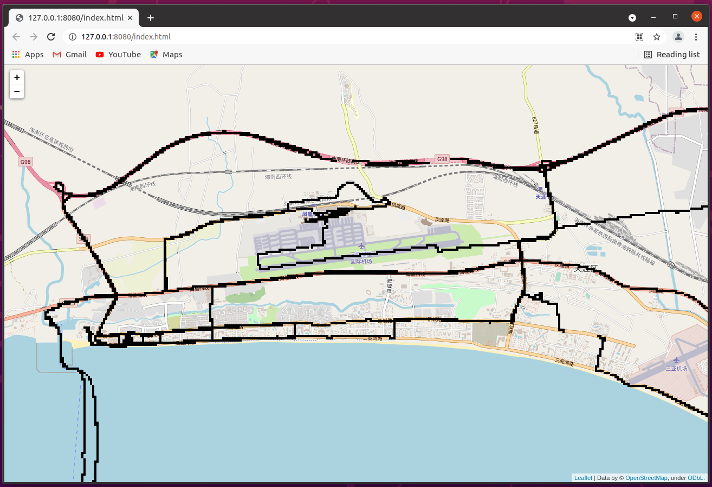

# Fog-of-World-Data-Parser
A data parser for the internal syncing data format used by [Fog of World](https://fogofworld.app/).
The parser is not designed to be a well-coded library with good performance, it is more like a demo for showing the data structure.

My motivation can be found in this [blog](https://www.zijun.dev/en/posts/fog-of-world-data-parser/).

Currently this cannot handle modification, there are some parts I haven't figure out.
You can find these by searching `TODO` in the repo.
Contributions are welcome and very appreciated.

**I'm also interested in building 3rd party tools for Fog of World, so don't hesitate to share your idea and need with me.**

